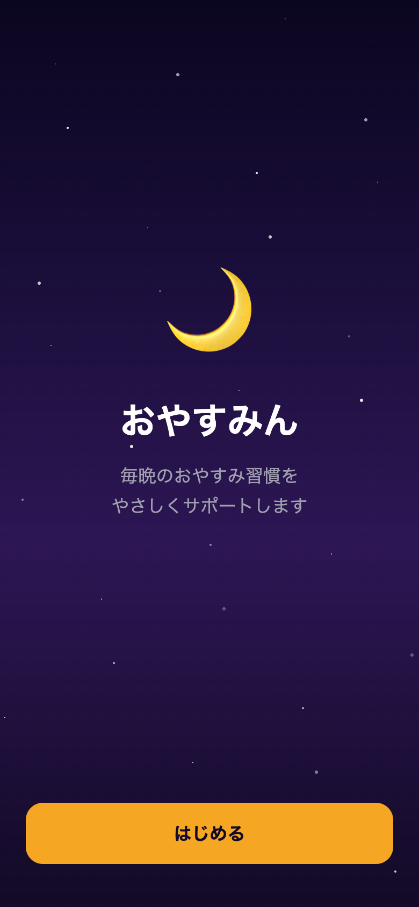
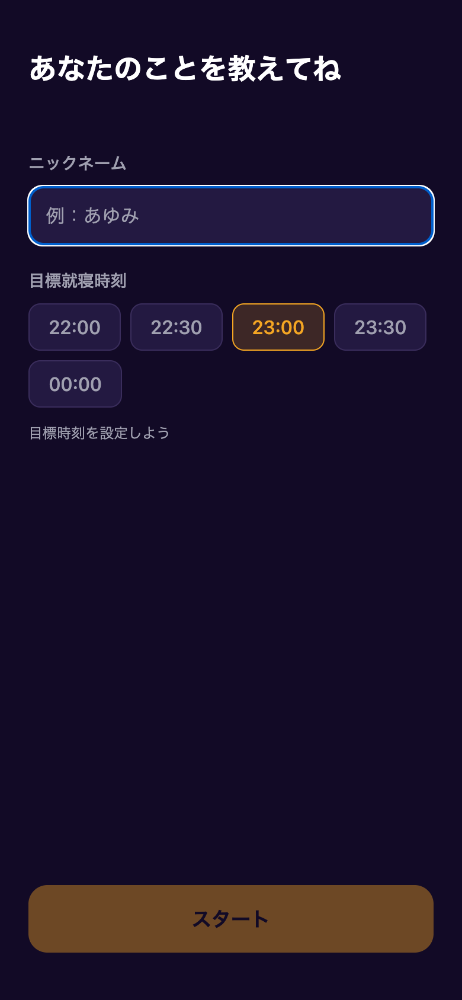
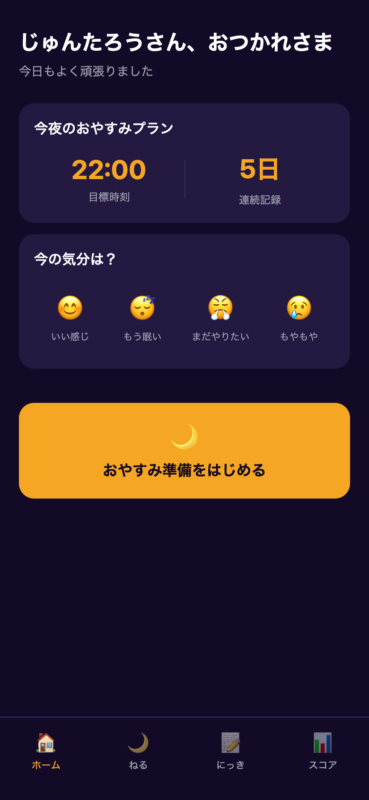
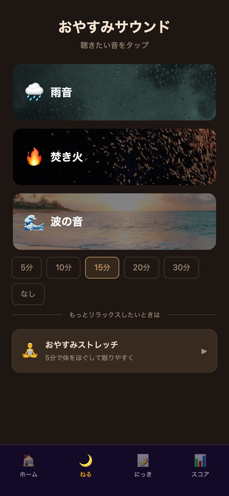
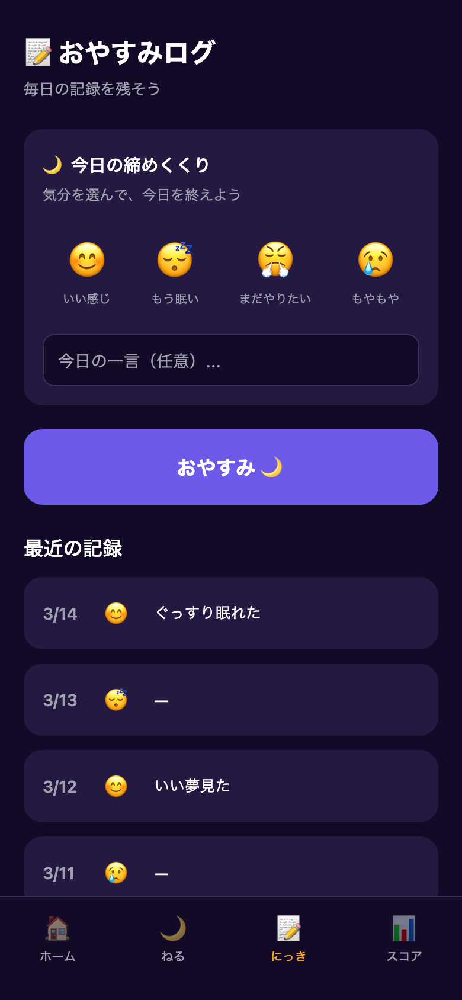
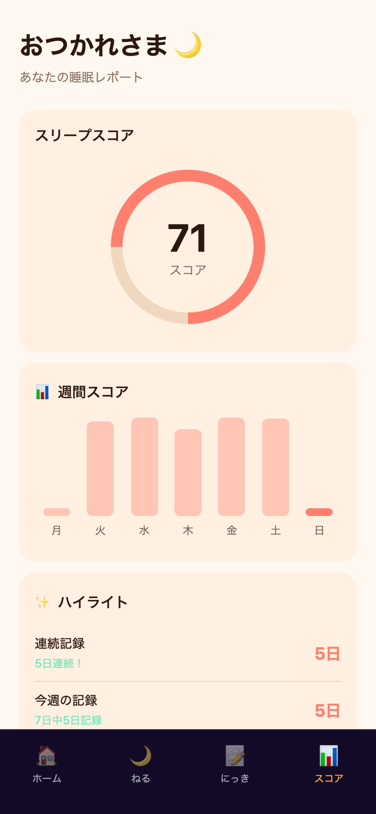

# おやすみん — アプリ仕様書

## 概要

| 項目 | 内容 |
|------|------|
| アプリ名 | おやすみん |
| バージョン | 1.0.0 |
| プラットフォーム | Web (iOS対応準備済み) |
| URL | https://sekimachi-design.github.io/apps/oyasumin/ |
| 技術スタック | React Native + Expo (expo-router) |
| データ保存 | ローカル (AsyncStorage / localStorage) |
| アカウント | 不要 |
| 言語 | 日本語 |

## コンセプト

「おやすみん」は、毎晩の就寝習慣をやさしくサポートするアプリです。
環境音の再生、おやすみストレッチ、気分の記録、睡眠スコアの可視化を通じて、ユーザーが心地よく眠りにつける習慣づくりを手助けします。

---

## 画面一覧

### 1. ウェルカム画面（初回起動時）



- 星空風のアニメーション背景にグラデーション効果
- アプリ名「おやすみん」とキャッチコピー「毎晩のおやすみ習慣をやさしくサポート」を表示
- 「はじめる」ボタンでセットアップ画面へ遷移
- 初回起動時のみ表示（オンボーディング完了後はスキップ）

### 2. セットアップ画面（初回起動時）



| 入力項目 | 内容 |
|---------|------|
| ニックネーム | 自由入力（必須） |
| 目標就寝時刻 | 22:00 / 22:30 / 23:00 / 23:30 / 00:00 から選択 |

- ニックネーム未入力時は「スタート」ボタンが非活性
- iOS版では通知許可をリクエストし、目標時刻30分前にリマインダーを送信
- 設定はローカルに保存され、アプリ再起動後も保持

### 3. ホーム画面（タブ: ホーム）



シンプルなダッシュボード画面。迷わず就寝準備へ進める設計。

| セクション | 内容 |
|-----------|------|
| 挨拶 | 「{名前}さん、おつかれさま」+「今日もよく頑張りました」 |
| おやすみプラン | 目標就寝時刻・連続記録日数を表示 |
| 今の気分 | 4つの気分から選択 → 気分に合ったメッセージを表示 |
| CTAボタン | 「おやすみ準備をはじめる」→ ねる画面へ遷移 |

#### 気分の選択肢

| 絵文字 | ラベル | レスポンス |
|--------|-------|-----------|
| 😊 | いい感じ | いい調子！このまま穏やかに過ごそう |
| 😴 | もう眠い | もうひと息。ゆっくり眠りに向かおう |
| 😤 | まだやりたい | よく頑張ったね。今日はもうおしまい |
| 😢 | もやもや | そんな日もあるよ。深呼吸してみよう |

### 4. ねる画面（タブ: ねる）



就寝準備のメイン画面。環境音が主役、ストレッチはオプション。

#### おやすみサウンド

自然写真を背景にした大きなカードで3種類の環境音を表示。タップでその場で再生開始。

| トラック | アイコン | 画像 | 素材 |
|---------|---------|------|------|
| 雨音 | 🌧️ | 森の雨 | BigSoundBank CC0 |
| 焚き火 | 🔥 | キャンプファイヤー | BigSoundBank CC0 |
| 波の音 | 🌊 | 暗い海 | BigSoundBank CC0 |

- 各トラック30秒・128kbps・ループ再生
- 再生中はミニプレーヤー表示（トラック名・残り時間・再生/停止/終了ボタン）
- iOS版ではバックグラウンド再生対応

#### タイマー

5分 / 10分 / **15分（デフォルト）** / 20分 / 30分 / なし から選択。
タイマー終了時に自動停止。

#### おやすみストレッチ（オプション）

「もっとリラックスしたいときは」ディバイダーの下に配置。
「おやすみストレッチ — 5分で体をほぐして眠りやすく」をタップで開始。

##### ストレッチ内容（全5種 × 約1分ずつ = 約5分）

| # | 名前 | 絵文字 | イラスト | フェーズ |
|---|------|--------|---------|---------|
| 1 | 深呼吸と瞑想 | 🧘 | kneehug.png | 3フェーズ（各20秒） |
| 2 | 肩のストレッチ | 🙆 | neck.png | 2フェーズ（各30秒、左右反転） |
| 3 | 肩回し | 💆 | shoulder.png | 2フェーズ（各30秒、左右反転） |
| 4 | ひねりストレッチ | 🔄 | twist.png | 2フェーズ（各30秒、左右反転） |
| 5 | おやすみポーズ | 😌 | relax.png | 3フェーズ（各20秒） |

##### ストレッチ画面の構成

- 上部: 現在のストレッチ名 + 閉じるボタン（✕）
- 残り時間テキスト
- セグメントバー: 全ストレッチの進捗をアニメーション付きで表示
- イラスト + 説明テキスト（`flipImage` で左右反転対応）
- タイムライン: 全ストレッチ一覧（完了済み✓・現在・未完了を区別）
- スキップボタン
- BGM: ジムノペディ第1番（ループ再生、完了時フェードアウト）
- 完了後:「おやすみの準備ができました — あとは目を閉じるだけ。いい夢を…」

### 5. にっき画面（タブ: にっき）



| セクション | 内容 |
|-----------|------|
| 今日の締めくくり | 気分選択（4種） + 一言メモ（任意） |
| おやすみボタン | タップで記録保存 + おやすみ演出 |
| 最近の記録 | 直近7日分の記録一覧（日付・気分・メモ） |
| 初回案内 | 記録がない場合「上の『おやすみ』ボタンで最初の記録をつけよう」 |

- 1日1件の記録（日付をキーとして管理）
- 記録済みの日は「今日は記録済み」と内容を表示
- 「おやすみ」タップ時にフェードアウト演出

### 6. スコア画面（タブ: スコア）



| セクション | 内容 |
|-----------|------|
| 挨拶 | 時間帯に応じた挨拶（おはよう/こんにちは/おつかれさま） |
| スリープスコア | 直近7日の記録率に基づく円形プログレス (0〜100) |
| 週間スコア | 過去7日間の棒グラフ（曜日表示） |
| ハイライト | 連続記録・今週の記録日数・総記録数 |
| 記録なし時 | 「まだ記録がありません」メッセージ |

---

## タブ構成

| タブ | 名前 | アイコン |
|------|------|---------|
| ホーム | ホーム | 🏠 |
| ねる | ねる | 🌙 |
| にっき | にっき | 📝 |
| スコア | スコア | 📊 |

---

## データ構造

### Settings（設定）

```typescript
type Settings = {
  name: string;        // ニックネーム
  targetTime: string;  // 目標就寝時刻 (HH:MM)
  onboardingDone: boolean;
};
```

保存先: `@oyasumin_settings` (AsyncStorage)

### SleepLog（睡眠ログ）

```typescript
type SleepLog = {
  date: string;       // YYYY-MM-DD（1日1件、日付がID）
  mood: number | null; // 気分インデックス (0-3)
  note: string;       // 一言メモ
  loggedAt: string;   // ISO timestamp
};
```

保存先: `@oyasumin_logs` (AsyncStorage)

### Stretch（ストレッチ）

```typescript
type StretchPhase = {
  text: string;
  duration: number;
  flipImage?: boolean;
};

type Stretch = {
  id: string;
  name: string;
  emoji: string;
  image: ReturnType<typeof require>;
  phases: StretchPhase[];
};
```

---

## 画面遷移図

```
[初回起動]
  └→ ウェルカム → セットアップ → ホーム

[通常起動]
  └→ ホーム（タブ）
       ├── ホーム
       │     └→ ねる（CTA「おやすみ準備をはじめる」）
       ├── ねる
       │     ├── サウンド再生（その場で再生）
       │     └── ストレッチ（オプション）
       ├── にっき（睡眠ログ記録）
       └── スコア（睡眠レポート）
```

---

## カラーテーマ

| テーマ | 使用画面 | 背景色 | アクセント色 |
|-------|---------|--------|------------|
| Dark | ホーム・にっき・オンボーディング | #120A26 | #F5A623 |
| Sepia | ねる（ナイトモード） | #1E1612 | #C8A064 |
| Morning | スコア | #FFF8F0 | #FF7F6E |

---

## 技術仕様

### 依存パッケージ（主要）

| パッケージ | 用途 |
|-----------|------|
| expo ~55.0.6 | フレームワーク |
| expo-router ~55.0.5 | ファイルベースルーティング |
| expo-audio | 環境音・ストレッチBGM再生 |
| expo-notifications | プッシュ通知（iOS版） |
| expo-splash-screen | スプラッシュ制御（iOS版） |
| @react-native-async-storage/async-storage | ローカルデータ保存 |
| react-native-svg | 円形プログレス表示 |
| react-native-safe-area-context | セーフエリア対応 |

### ファイル構成

```
app/
  _layout.tsx            # ルートレイアウト（SettingsProvider + オンボーディングゲート）
  (tabs)/
    _layout.tsx          # タブナビゲーション（ホーム/ねる/にっき/スコア）
    index.tsx            # ホーム画面（ダッシュボード）
    night.tsx            # ねる画面（サウンド + ストレッチ）
    log.tsx              # にっき画面（睡眠ログ）
    report.tsx           # スコア画面（睡眠レポート）
  onboarding/
    _layout.tsx          # オンボーディングレイアウト
    welcome.tsx          # ウェルカム画面（星空アニメーション）
    setup.tsx            # セットアップ画面（名前・目標時刻設定）
hooks/
    useSettings.ts       # 設定管理（Context + AsyncStorage）
    useSleepLogs.ts      # ログCRUD
    useStats.ts          # 統計計算（スコア・連続記録・週間データ）
    useAudio.ts          # 音声再生制御（5トラック + タイマー）
components/
    Card.tsx             # 汎用カードコンポーネント
    ProgressRing.tsx     # 円形プログレス（SVG）
    BarChart.tsx         # 棒グラフ
constants/
    Colors.ts            # カラーテーマ定義（Dark/Sepia/Morning）
    Content.ts           # 静的コンテンツ（気分選択肢・おすすめ・ストレッチデータ）
    Types.ts             # 型定義
services/
    notifications.ts     # 通知管理（Webではスキップ）
assets/
    audio/               # 環境音MP3（5曲 × 30秒）+ ストレッチBGM
    images/              # 自然写真（rain/fire/ocean/forest/whitenoise）
    images/stretch/      # ストレッチイラスト（いらすとや）
```

---

## アセット

### 環境音

| トラック | ファイル | ライセンス |
|---------|---------|----------|
| 雨音 | rain.mp3 | CC0 (BigSoundBank) |
| 焚き火 | fire.mp3 | CC0 (BigSoundBank) |
| 波の音 | ocean.mp3 | CC0 (BigSoundBank) |
| 森林 | forest.mp3 | CC0 (BigSoundBank) |
| ホワイトノイズ | whitenoise.mp3 | CC0 (BigSoundBank) |
| ストレッチBGM | stretch_bgm.mp3 | ジムノペディ第1番（パブリックドメイン） |

### 自然写真

| 用途 | ファイル | 出典 |
|------|---------|------|
| 雨音カード | rain.jpg | Pexels（フリー素材） |
| 焚き火カード | fire.jpg | Pexels（フリー素材） |
| 波の音カード | ocean.jpg | Pexels（フリー素材） |

### ストレッチイラスト

| 用途 | ファイル | 出典 |
|------|---------|------|
| 深呼吸と瞑想 | kneehug.png | いらすとや |
| 肩のストレッチ | neck.png | いらすとや |
| 肩回し | shoulder.png | いらすとや |
| ひねりストレッチ | twist.png | いらすとや |
| おやすみポーズ | relax.png | いらすとや |

---

## UX設計方針

- **1画面1アクション**: 各画面に明確な主目的を設定し、ユーザーが迷わない設計
  - ホーム = ダッシュボード + 就寝準備への誘導
  - ねる = サウンド選択がメイン、ストレッチはオプション
  - にっき = 睡眠ログの記録
  - スコア = 振り返り
- **ストレッチは押し付けない**: 「もっとリラックスしたいときは」というコピーで、やりたい人だけが選択
- **記録のハードルを下げる**: 気分選択（タップ1回）+ 任意メモで最小限の入力

---

## デプロイ

- ホスティング: GitHub Pages (`sekimachi-design.github.io`)
- パス: `/apps/oyasumin/`
- ビルド: `npx expo export --platform web`（baseUrl: `/apps/oyasumin`）
- デプロイ先: `sekimachi-design.github.io` リポジトリの `apps/oyasumin/` ディレクトリ
