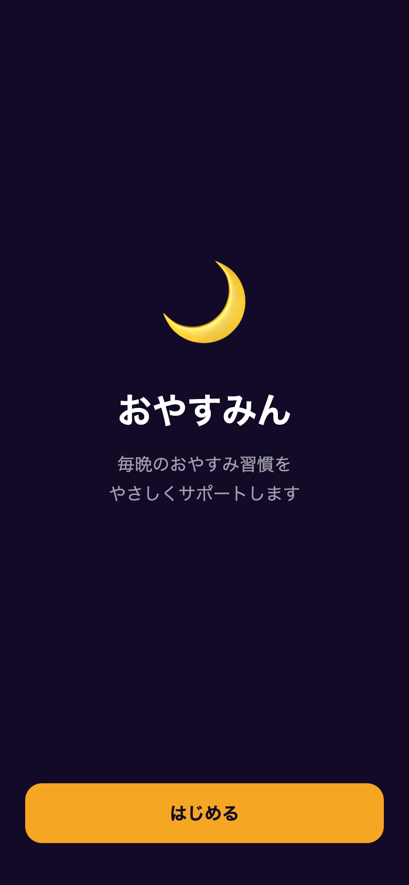
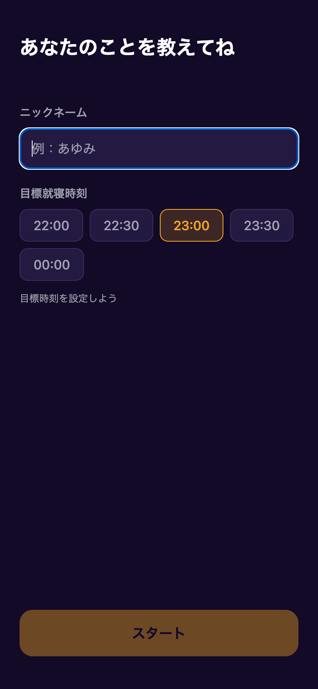
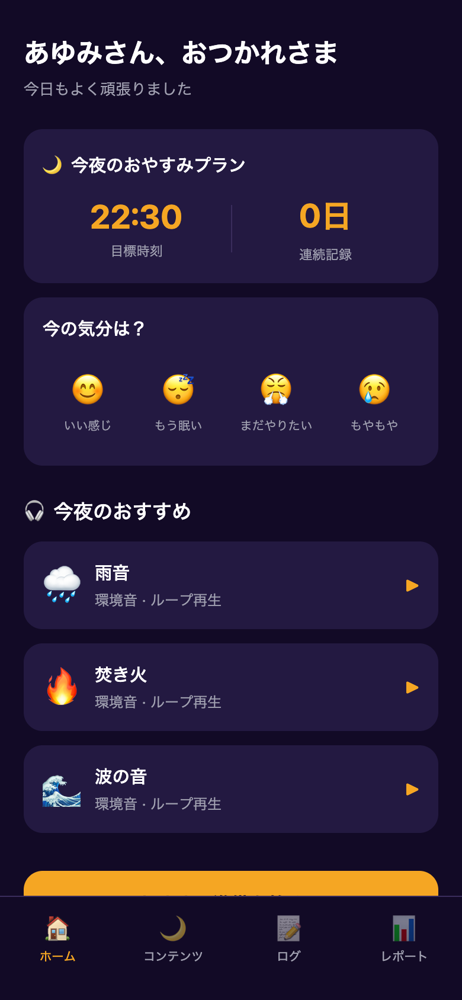
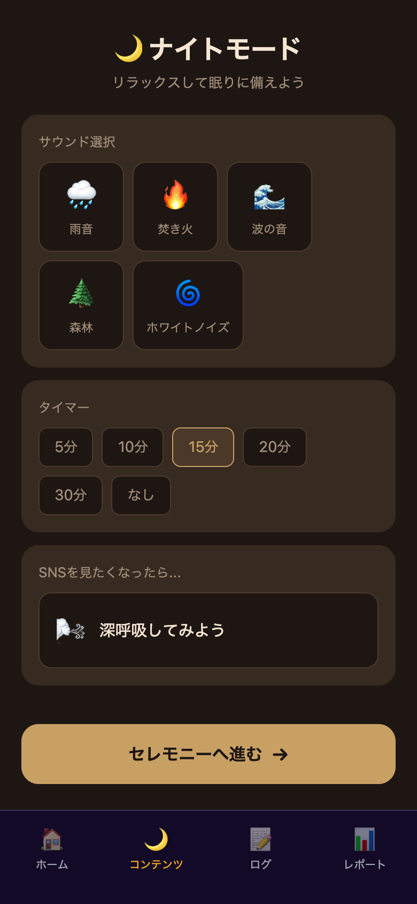
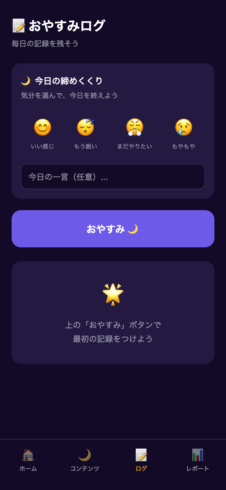
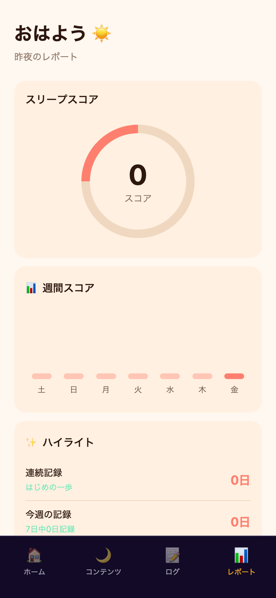

# おやすみん — アプリ仕様書

## 概要

| 項目 | 内容 |
|------|------|
| アプリ名 | おやすみん |
| バージョン | 1.0.0 |
| プラットフォーム | Web (iOS対応準備済み) |
| URL | https://riechikamori.github.io/oyasumin/ |
| 技術スタック | React Native + Expo (expo-router) |
| データ保存 | ローカル (AsyncStorage / localStorage) |
| アカウント | 不要 |
| 言語 | 日本語 |

## コンセプト

「おやすみん」は、毎晩の就寝習慣をやさしくサポートするアプリです。
環境音の再生、気分の記録、睡眠スコアの可視化を通じて、ユーザーが心地よく眠りにつける習慣づくりを手助けします。

---

## 画面一覧

### 1. ウェルカム画面（初回起動時）



- アプリのロゴ（🌙）とキャッチコピーを表示
- 「はじめる」ボタンでセットアップ画面へ遷移
- 初回起動時のみ表示（オンボーディング完了後はスキップ）

### 2. セットアップ画面（初回起動時）



| 入力項目 | 内容 |
|---------|------|
| ニックネーム | 自由入力（必須） |
| 目標就寝時刻 | 22:00 / 22:30 / 23:00 / 23:30 / 00:00 から選択 |

- ニックネーム未入力時は「スタート」ボタンが非活性
- iOS版では通知許可をリクエストし、目標時刻30分前にリマインダーを送信
- 設定はローカルに保存され、アプリ再起動後も保持

### 3. ホーム画面



| セクション | 内容 |
|-----------|------|
| 挨拶 | 「{名前}さん、おつかれさま」 |
| おやすみプラン | 目標時刻・連続記録日数を表示 |
| 今の気分 | 😊いい感じ / 😴もう眠い / 😤まだやりたい / 😢もやもや |
| 今夜のおすすめ | 環境音トラック一覧（タップでコンテンツ画面へ遷移+自動再生） |
| CTAボタン | 「おやすみ準備を始める」→ コンテンツ画面へ遷移 |

### 4. コンテンツ画面（ナイトモード）



#### サウンド選択

| トラック | アイコン | 素材 |
|---------|---------|------|
| 雨音 | 🌧️ | BigSoundBank CC0 |
| 焚き火 | 🔥 | BigSoundBank CC0 |
| 波の音 | 🌊 | BigSoundBank CC0 |
| 森林 | 🌲 | BigSoundBank CC0 |
| ホワイトノイズ | 🌀 | BigSoundBank CC0 |

- 各トラック30秒・128kbps・ループ再生
- iOS版ではバックグラウンド再生対応

#### タイマー

5分 / 10分 / 15分 / 20分 / 30分 / なし から選択。
タイマー終了時に自動停止。

#### 深呼吸ガイド

「SNSを見たくなったら…」セクション。
タップで4-7-8呼吸法のガイドを表示（4秒吸って、7秒止めて、8秒吐く）。

#### 遷移

「セレモニーへ進む →」ボタンでログ画面へ。

### 5. ログ画面（おやすみログ）



| セクション | 内容 |
|-----------|------|
| 今日の締めくくり | 気分選択（4種） + 一言メモ（任意） |
| おやすみボタン | タップで記録保存 + おやすみ演出 |
| 最近の記録 | 直近7日分の記録一覧（日付・気分・メモ） |
| 初回案内 | 記録がない場合「上の『おやすみ』ボタンで最初の記録をつけよう」 |

- 1日1件の記録（日付をキーとして管理）
- 記録済みの日は「✅ 今日は記録済み」と内容を表示
- 「おやすみ」タップ時にフェードアウト演出

### 6. レポート画面



| セクション | 内容 |
|-----------|------|
| スリープスコア | 直近7日の記録率に基づく円形プログレス (0〜100) |
| 週間スコア | 過去7日間の棒グラフ（曜日表示） |
| ハイライト | 連続記録・今週の記録日数・総記録数 |
| 記録なし時 | 「まだ記録がありません」メッセージ |

---

## データ構造

### Settings（設定）

```typescript
type Settings = {
  name: string;        // ニックネーム
  targetTime: string;  // 目標就寝時刻 (HH:MM)
  onboardingDone: boolean;
};
```

保存先: `@oyasumin_settings` (AsyncStorage)

### SleepLog（睡眠ログ）

```typescript
type SleepLog = {
  date: string;       // YYYY-MM-DD（1日1件、日付がID）
  mood: number | null; // 気分インデックス (0-3)
  note: string;       // 一言メモ
  loggedAt: string;   // ISO timestamp
};
```

保存先: `@oyasumin_logs` (AsyncStorage)

---

## 画面遷移図

```
[初回起動]
  └→ ウェルカム → セットアップ → ホーム

[通常起動]
  └→ ホーム（タブ）
       ├── ホーム
       │     └→ コンテンツ（おすすめタップ/CTA）
       ├── コンテンツ（ナイトモード）
       │     └→ ログ（セレモニーへ進む）
       ├── ログ（おやすみログ）
       └── レポート
```

---

## カラーテーマ

| テーマ | 使用画面 | 背景色 | アクセント色 |
|-------|---------|--------|------------|
| Dark | ホーム・ログ・オンボーディング | #120A26 | #F5A623 |
| Sepia | コンテンツ（ナイトモード） | #1E1612 | #C8A064 |
| Morning | レポート | #FFF8F0 | #FF7F6E |

---

## 技術仕様

### 依存パッケージ（主要）

| パッケージ | 用途 |
|-----------|------|
| expo ~55.0.6 | フレームワーク |
| expo-router ~55.0.5 | ファイルベースルーティング |
| expo-audio | 環境音再生 |
| expo-notifications | プッシュ通知（iOS版） |
| expo-splash-screen | スプラッシュ制御（iOS版） |
| @react-native-async-storage/async-storage | ローカルデータ保存 |
| react-native-reanimated | アニメーション |

### ファイル構成

```
app/
  _layout.tsx            # ルートレイアウト（SettingsProvider + オンボーディングゲート）
  (tabs)/
    _layout.tsx          # タブナビゲーション
    index.tsx            # ホーム画面
    night.tsx            # コンテンツ画面（ナイトモード）
    log.tsx              # ログ画面
    report.tsx           # レポート画面
  onboarding/
    _layout.tsx          # オンボーディングレイアウト
    welcome.tsx          # ウェルカム画面
    setup.tsx            # セットアップ画面
hooks/
    useSettings.ts       # 設定管理（Context + AsyncStorage）
    useSleepLogs.ts      # ログCRUD
    useStats.ts          # 統計計算
    useAudio.ts          # 音声再生制御
components/
    Card.tsx             # 汎用カードコンポーネント
    ProgressRing.tsx     # 円形プログレス
    BarChart.tsx         # 棒グラフ
constants/
    Colors.ts            # カラーテーマ定義
    Content.ts           # 静的コンテンツ（気分選択肢・おすすめ）
    Types.ts             # 型定義
services/
    notifications.ts     # 通知管理（Webではスキップ）
assets/
    audio/               # 環境音MP3（5曲 × 30秒）
```

---

## ライセンス

| 素材 | ライセンス | 出典 |
|------|----------|------|
| 環境音（5曲） | CC0 (パブリックドメイン) | BigSoundBank.com |

---

## 今後の拡張予定（iOS版リリース時）

- Apple Developer Program 登録（$99/年）
- EAS Build による iOS ビルド
- App Store 提出（アイコン・プライバシーポリシー・スクリーンショット準備）
- 実音声素材への差し替え（より長尺・高品質なフリー素材）
